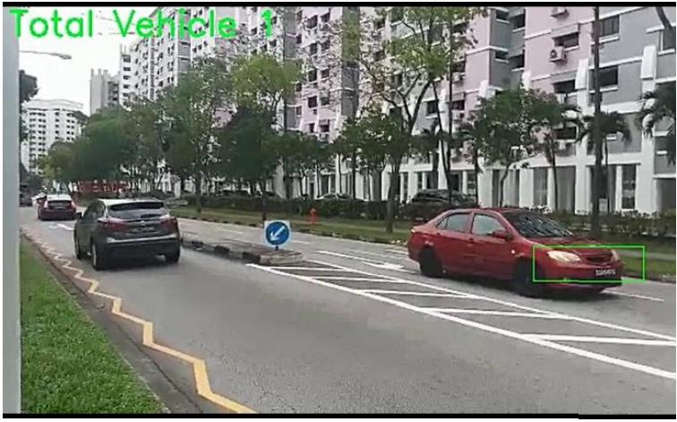

# Vehicle Detection and Counting with Tiny-YOLO
YOLO a deep learning computer vision model is used to detect and count the number of vehicle on the road to determine the traffic situation. 

## Table of Contents
* [General Info](#general-information)
* [Technologies Used](#technologies-used)
* [Screenshots](#screenshots)
* [Setup](#setup)
* [Test Dependencies](#test-dependencies)
* [Training](#training)
* [Counting Vehicle](#counting-vehicle) 

## General Information

This intelligent transport system project aims to reduce manpower needed and coordination work for an autonomous vehicle test trial by building dynamic roadblocks (a.k.a Smart traffic lights). Cameras are installed to monitor traffic conditions so that the traffic light can make a better decision on what the logic should be. To determine the traffic situation, tiny-YOLO, a computer vision model is used to detect and count the vehicle.   

## Technologies Used

- Ubuntu  - Ubuntu 16.04 
- Cuda    - CUDA Toolkit 8.0 
- OpenCV  - OpenCV 3.4.0 
- Cudnn   - Cudnn 7.0.5
- Darknet - https://github.com/AlexeyAB/darknet.git

## Screenshots


## Setup

### Ubuntu Dual Boot Installation 
Step-by-step video guide for dual booting Ubuntu: https://youtu.be/4jGQl6SeS2o 

### Darknet Installation 
```
$ git clone https://github.com/AlexeyAB/darknet
$ cd darknet
$ make
```
### Dependencies Installation
- CUDA
  - Check version of Cuda installed is compatible to GPU model: https://en.wikipedia.org/wiki/CUDA
  - Installation Guide used: https://developer.nvidia.com/cuda-80-ga2-download-archive
  - Change first line of the Makefile `GPU=1` and `$make` the project 
  
- OPENCV
  - OpenCV 3.4.0 is installed
  - Installation Guide used: https://www.pytorials.com/how-to-install-opencv340-on-ubuntu1604/
  - Change third line of the Makefile `OPENCV=1` and `$make` the project
 
- CUDNN
  - Cudnn 7.0.5 is installed 
  - Installation guide used: https://docs.nvidia.com/deeplearning/sdk/cudnn-install/index.html
  - Change second line of the Makefile `CUDNN=1` and '$make' the project

## Test Dependencies 
Install pre-trained weight file and test if object in image can be detected
```
$ wget https://pjreddie.com/media/files/yolov3.weights
$ ./darknet detect cfg/yolov3.cfg yolov3.weights/< image file >
```
## Training 
### Downloading dataset from OIDv4
This is the guide used to download dataset: https://youtu.be/zJDUhGL26iU

### Webscrapping custom dataset with Selenium (only Bing search engine) 
- Download the correct chromedriver - https://chromedriver.chromium.org/ 
- Download the script
```
 git clone https://gist.github.com/SellersEvan/420aa58176e6aed3b043b034f010f2d5.js
```
- Download the images
```
$ python3 bing_images_download.py -u ‘<URL of after searching the photo>' --limit <Max No. of image> --chromedriver <address of chromedriver> 
$ python3 bing_images_download.py -u ‘https://www.bing.com/images/search?q=6-Seat+Golf+Cart&FORM=RESTAB' --limit 120 --chromedriver /home/<user name>/chromedriver 
```

### Data Augmentation
Colab notebook used for reference: https://github.com/victor-mageto/multiple-image-augmentation-using-ImageDataGenerator-/blob/master/original_data_augmentation.ipynb

### Labelling
This is the guide used to label dataset: https://youtu.be/EGQyDla8JNU

### Training
- This is the guide used to train on local machine: https://youtu.be/zJDUhGL26iU
- This is the guide used to train on google colab: https://youtu.be/10joRJt39Ns

## Counting Vehicle
Code reference: https://github.com/augmentedstartups/YOLOv4-Tutorials 


